# 💈 Barbershop

<p align="center">
  <a href="https://github.com/lucas-hochmann-rosa/barber-shop-suite">
    
  </a>
  <a href="https://www.linkedin.com/in/lucas-hochmann-rosa">
    
  </a>
  <a href="#-tech-stack">
    
  </a>
  <a href="#-tech-stack">
    
  </a>
  <a href="#-tech-stack">
    
  </a>
  <a href="./LICENSE">
    
  </a>
</p>

<p align="center"><a href="README.md">🇧🇷 Português</a> · 🇺🇸 English</p>

> Barbershop operational management system structured as a four-module monorepo: a shared business rules core in Java (`core`), a desktop application in Java Swing (`desktop`), a modern web interface in HTML, CSS and JS (`web`), and a Spring Boot REST API back-end (`api`).

---

## ⚡ Quick Start

```bash
# 1. Clone the repository
git clone https://github.com/lucas-hochmann-rosa/barber-shop-suite.git
cd barber-shop-suite

# 2. Spin up MySQL (via Docker or local MySQL on port 3306)
docker compose up -d

# 3. Compile and package all modules (core, desktop, api)
mvn clean package

# 4. Run the Desktop application (Java Swing)
java -jar desktop/target/barber-shop-desktop-1.0-SNAPSHOT.jar

# 5. Run the Spring Boot REST API (Web Back-end)
java -jar api/target/barber-shop-api-1.0-SNAPSHOT.jar
# port 8080

# 6. Optional: load the shared demo database
java -cp desktop/target/barber-shop-desktop-1.0-SNAPSHOT.jar br.com.barbershop.app.SeedDemoData
# or, with the API running: curl -X POST http://localhost:8080/api/dev/seed

# 7. Run the static Web Front-end from the repository root
python -m http.server 5500
# access http://localhost:5500/web/index.html (demo login: barbershop / barbershop)
```

---

## 📌 Overview

**Barbershop** is a complete barbershop management system (appointments, staff, services, history, and revenue), built on a modular architecture:

- **Shared Core (`core`)**: Centralizes domain entities, JDBC persistence, idempotent migrations, and core business rules (such as RF11 visual classification and RF10 real time-overlap conflict validation), decoupled from any visual UI.
- **Desktop Application (`desktop`)**: Built with Java Swing (FlatLaf Look & Feel) featuring automatic bootstrap, services/barbers CRUD, real-time schedule management, reports dashboard, and an operational smoke test (`VerificacaoSistema`).
- **Web Version (`web`)**: Modern static front-end in HTML5, CSS3, and JavaScript, featuring an **interactive daily schedule timeline** and real REST client integration (`web/js/api.js`).
- **Web REST Back-end (`api`)**: Java Web application with Spring Boot 3.2.5 REST, exposing JSON endpoints for authentication, barbershop management, catalog, scheduling, history, and analytics.

---

## 🏗️ Architecture

```text
barber-shop-suite/
├── pom.xml                             # Parent POM with centralized dependency management
├── docker-compose.yml                  # Pre-configured MySQL 8 container
├── README.md / README.en.md
├── LICENSE
├── docs/                               # Technical documentation and wireframes
│   ├── screenshots/
│   └── wireframes/
│
├── shared-assets/
│   └── img/                            # Official source for brand, service, and avatar SVGs
│
├── core/                               # [MODULE 1] Shared business rules core (Java)
│   ├── pom.xml
│   └── src/
│       ├── main/java/br/com/barbershop/
│       │   ├── model/                  # Domain POJOs
│       │   ├── dao/                    # JDBC/MySQL access layer (Repository Pattern)
│       │   ├── service/                # Business services (Agenda, Auth, Catalogo, Classificador, Relatorio)
│       │   ├── seed/                   # Shared demo data, independent from Spring and Swing
│       │   └── util/                   # Security hashing and date utilities
│       └── test/java/                  # 52 unit tests with in-memory fake repositories
│
├── desktop/                            # [MODULE 2] Desktop Java Swing interface (FlatLaf)
│   ├── pom.xml
│   └── src/main/java/br/com/barbershop/
│       ├── app/                        # Main entry point, ServiceFactory, SystemVerification, and SeedDemoData
│       └── ui/                         # Swing views and controllers
│
├── web/                                # [MODULE 3] Front-end Web (HTML5, CSS3, JavaScript)
│   ├── index.html, agenda.html, agendamento.html, barbearia.html, historico.html, relatorios.html
│   ├── verificacao-classificacao.html  # Visual runner for RF11 parity verification
│   ├── css/                            # Modular styles
│   └── js/                             # UI logic and REST client (api.js)
│
└── api/                                # [MODULE 4] Spring Boot 3.2.5 REST API
    ├── pom.xml
    └── src/
        ├── main/java/br/com/barbershop/api/
        │   ├── Application.java
        │   ├── config/                 # ServiceConfig and WebMvcConfig (CORS/Static)
        │   ├── controller/             # REST Controllers (Auth, Barbearia, Catalogo, Agenda, Historico, Relatorios, DevSeed)
        │   └── dto/                    # Data Transfer Objects
        └── test/java/                  # 14 MockMvc integration tests
```

---

## 🚀 Running Each Module

### 1. `core`

Shared domain and data-access library consumed by the desktop app and the API:

```bash
mvn test -pl core
```

### 2. `desktop`

Requires JDK 17+ and MySQL 8:

```bash
docker compose up -d
mvn clean package -pl desktop
java -jar desktop/target/barber-shop-desktop-1.0-SNAPSHOT.jar
```

Apache NetBeans can run the `desktop` module through its `nbactions.xml`.

### 3. `api`

```bash
mvn install -pl core -am -DskipTests
mvn -f api/pom.xml spring-boot:run
# or
mvn clean package -pl api
java -jar api/target/barber-shop-api-1.0-SNAPSHOT.jar
```

The API is available at `http://localhost:8080/api/` and also serves the `web/` front-end. In Apache NetBeans, the `api` module Run action is bound to `spring-boot:run` through `api/nbactions.xml`.

### 4. `web`

```bash
python -m http.server 5500
```

Access <http://localhost:5500/web/index.html>. The static front-end still reads and writes real data through `http://localhost:8080/api`.

Demo credentials after loading the demo database:

- **User:** `barbershop`
- **Password:** `barbershop`

If the initial setup flow is completed manually, use the credentials created in that setup.

---

## 🔄 Shared Core and RF11 Parity

The RF11 schedule classification rule lives in the shared `core` module through `br.com.barbershop.service.ClassificadorAgenda`. The web version mirrors the same rule in `web/js/classificacao.js`, and `web/verificacao-classificacao.html` runs the browser-side parity checks against the same classification scenarios covered by JUnit.

---

## 🌱 Shared Demo Data

The web front-end no longer uses static JavaScript arrays as its data source. Demo data is written to MySQL by `br.com.barbershop.seed.DadosDemonstracaoSeeder` in the `core` module, using only public services (`SetupService`, `CatalogoService`, `AgendaService`, and `BarbeariaService`). That keeps desktop, web, and API pointed at the same barbershop, services, barbers, users, and appointments.

Seeding is manual and idempotent: `semearSeNecessario()` only inserts data when `BarbeariaService.buscarPrimeira()` returns `null`, preserving the empty-database RF01 setup scenario.

```bash
# Desktop command-line seed
mvn clean package -pl desktop
java -cp desktop/target/barber-shop-desktop-1.0-SNAPSHOT.jar br.com.barbershop.app.SeedDemoData

# Development API seed, after starting the API
curl -X POST http://localhost:8080/api/dev/seed
```

There is also a **Carregar dados de demonstração** button in the desktop initial setup screen. The seed includes one barbershop, six services, four barbers, the `barbershop` user with a real `HashUtil` password hash, and appointments distributed across RF11 classifications.

---

## 🖼️ Shared Images

Logo, service, and avatar SVG files have a single versioned source: `shared-assets/img`. The web front-end references those files through `/shared-assets/img/...`, the API exposes that path as a static resource in development, and the desktop module does not keep manual copies. During `generate-resources`, `maven-resources-plugin` copies `../shared-assets/img` into the desktop classpath (`target/classes/img`), and Swing screens load those SVGs through `FlatSVGIcon`.

This keeps the visual identity aligned across web, API, and desktop, avoids asset drift, and preserves a text fallback in Swing when an icon cannot be found in the build.

---

## 🛠️ Tech Stack

- **Platform:** Java 17 · Spring Boot 3.2.5 · HTML5 / CSS3 / Vanilla JavaScript
- **Build System:** Apache Maven (multi-module monorepo)
- **Desktop UI:** Java Swing (FlatLaf `3.4.1` and FlatLaf Extras for SVG rendering)
- **Web Back-end:** Spring Boot 3.2.5 REST (Spring MVC, Jackson JSR-310)
- **Database:** MySQL 8 + JDBC (`mysql-connector-j 8.3.0`), HikariCP `5.1.0`
- **Testing:** JUnit 5 (Jupiter) & Spring MockMvc (66 automated tests)
- **Containerization:** Docker & Docker Compose

---

## 🧪 Automated Testing

```bash
mvn clean test
```

Executes 66 automated tests:
- 52 unit tests across `core` services and domain models.
- 14 integration and controller tests across `api` REST endpoints.

---

## 📸 Screenshots

### Desktop

| Desktop Login | Desktop Initial Setup |
| --- | --- |
| 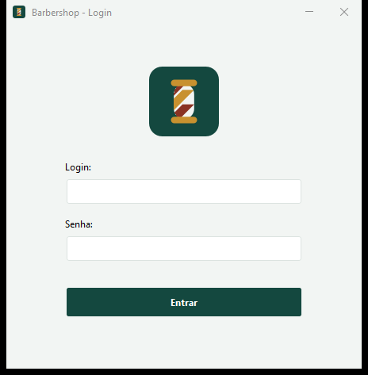 | 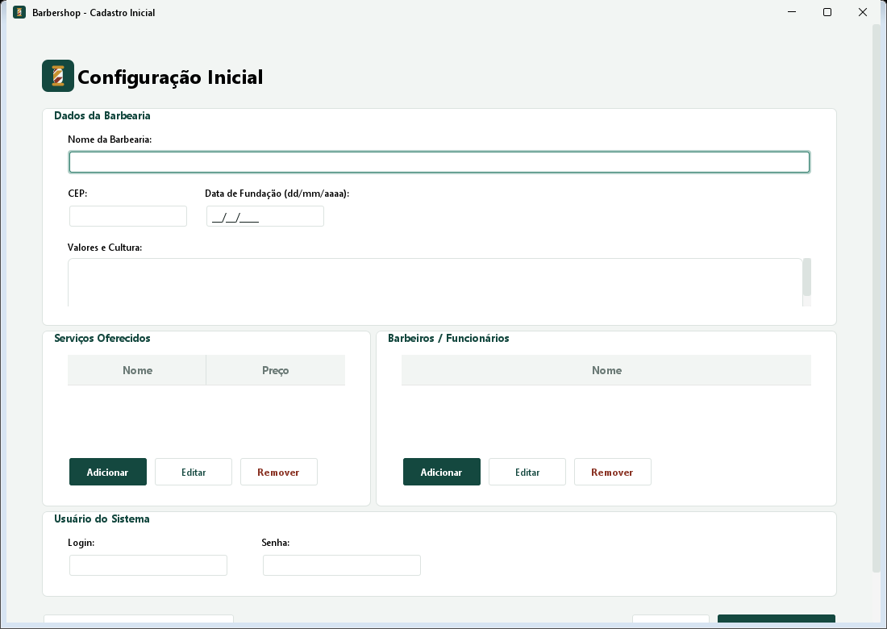 |

| Desktop Home (Schedule) | Desktop New Appointment |
| --- | --- |
| 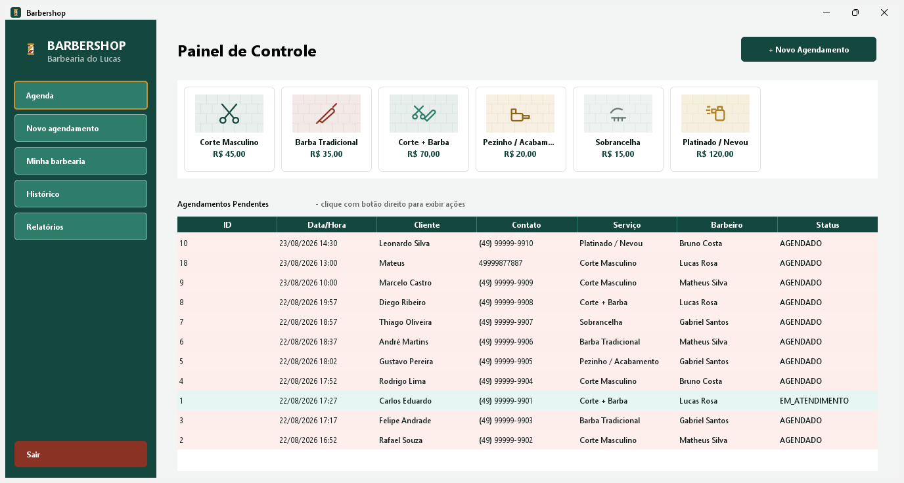 | 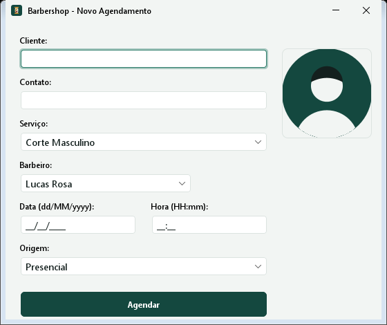 |

| Desktop My Barbershop | Desktop History |
| --- | --- |
| 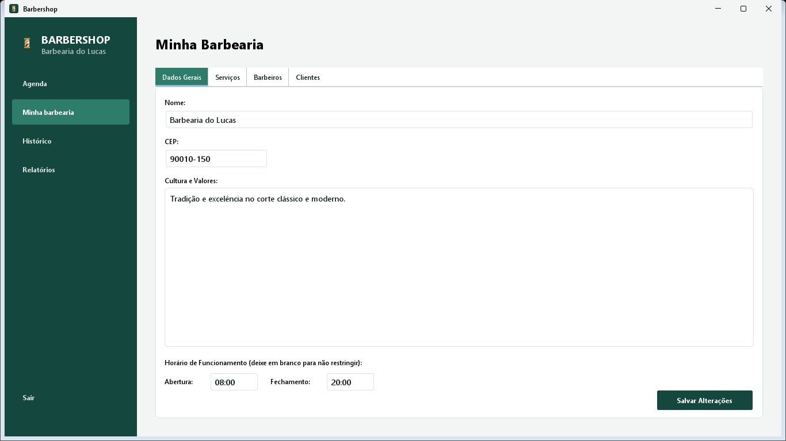 | 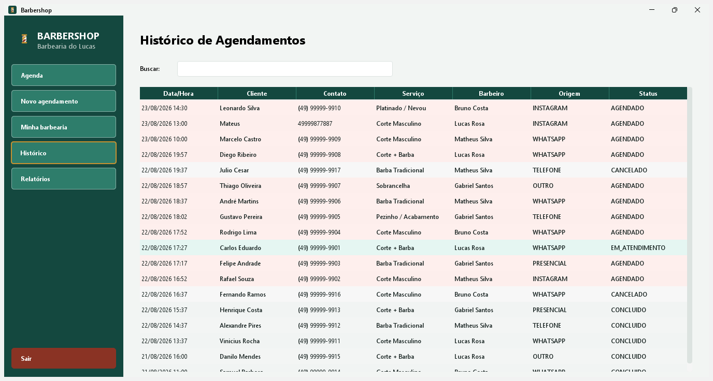 |

| Desktop Reports | Desktop Manage Barber |
| --- | --- |
| 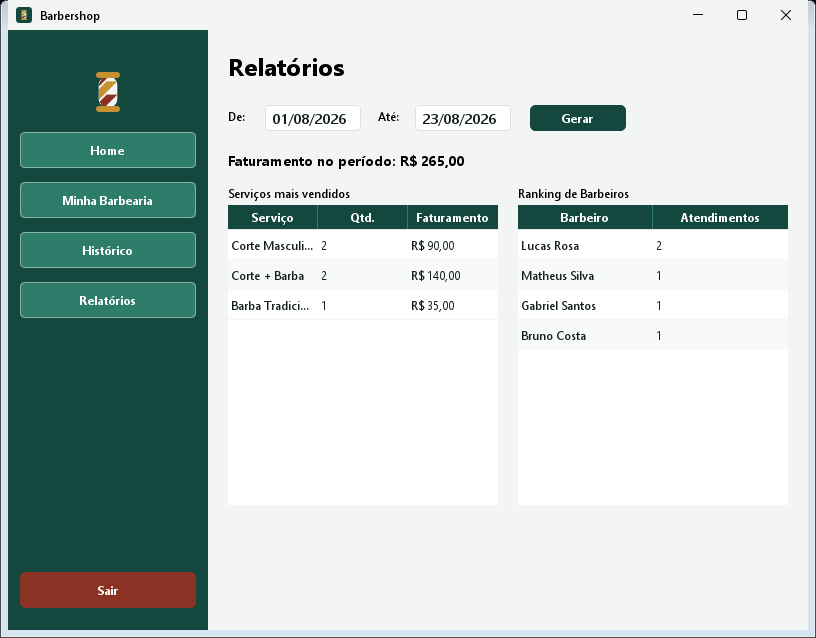 | 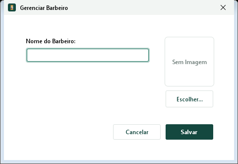 |

### Web

| Web Login | Web Home (Schedule) |
| --- | --- |
| 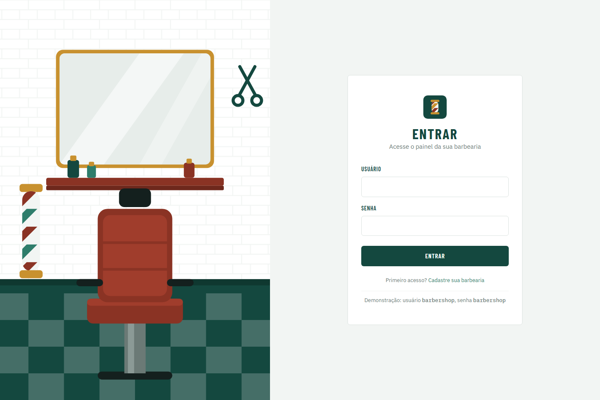 | 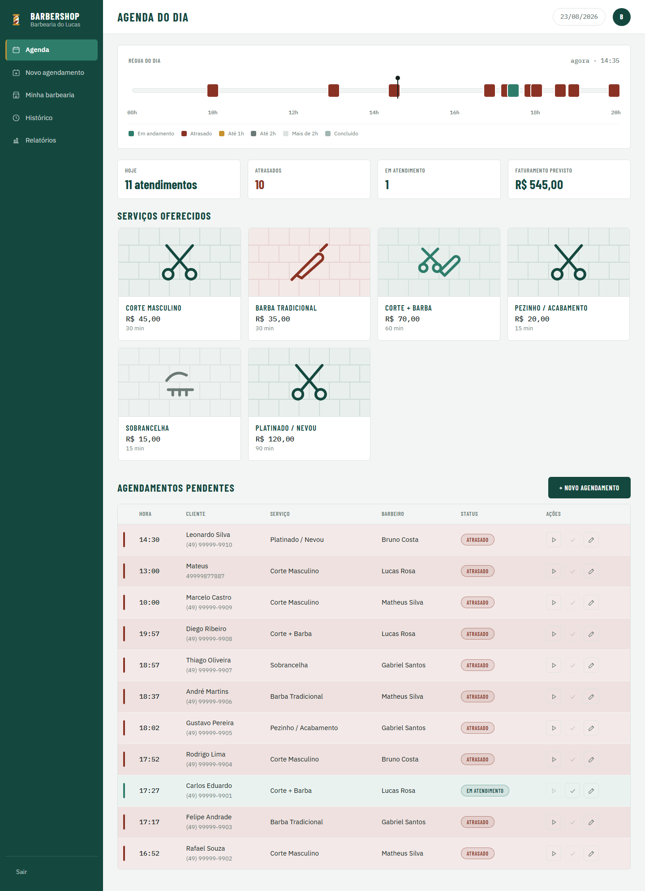 |

| Web New Appointment | Web My Barbershop |
| --- | --- |
| 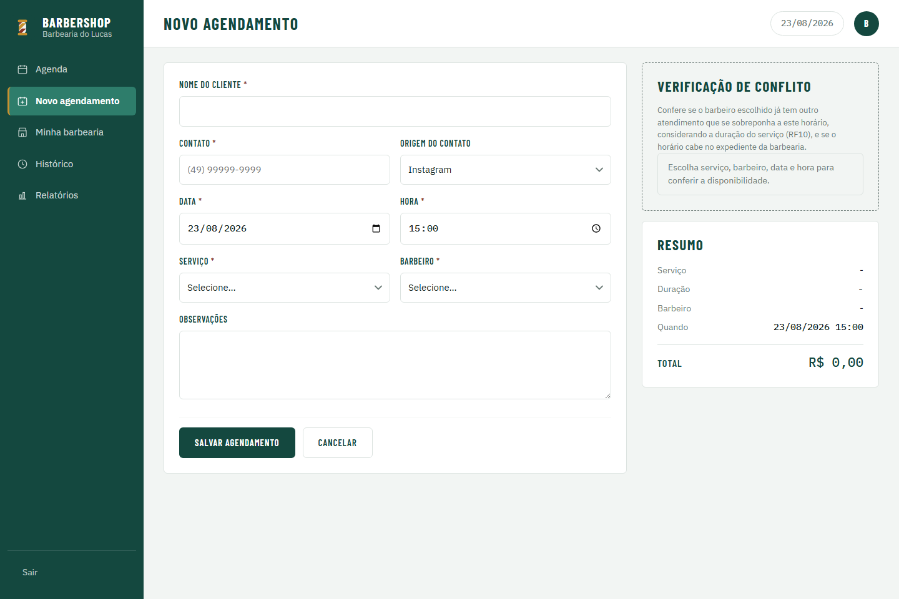 | 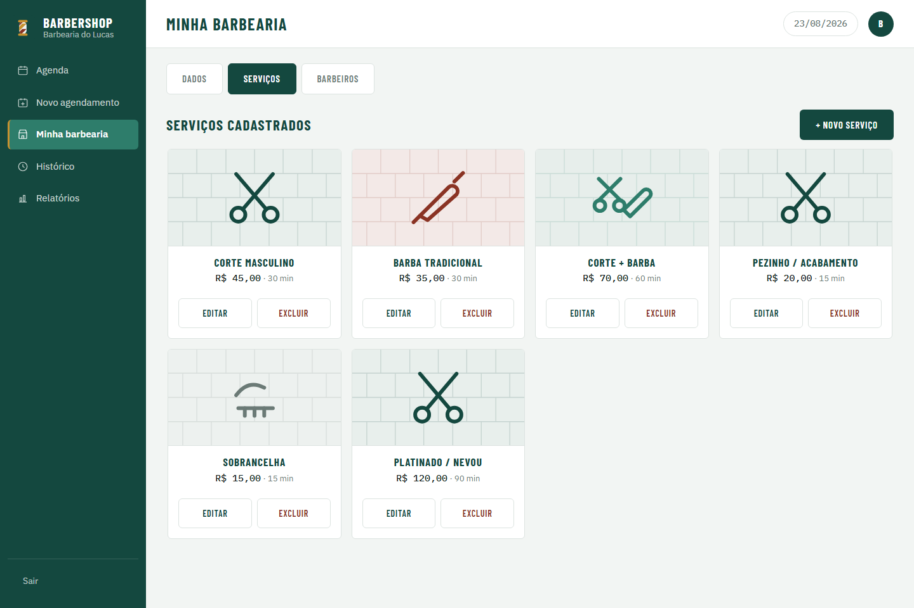 |

| Web History | Web Reports |
| --- | --- |
| 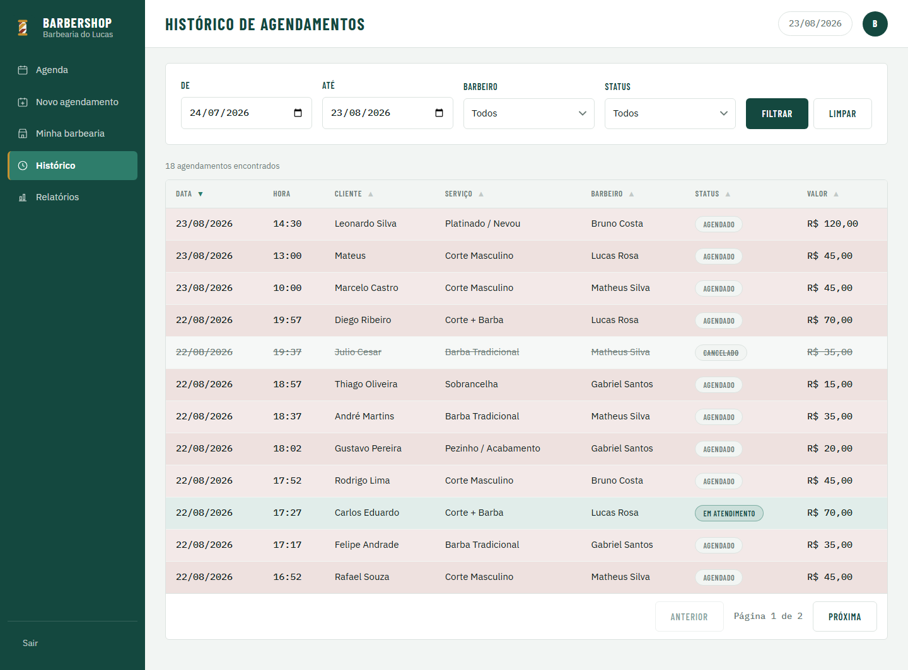 | 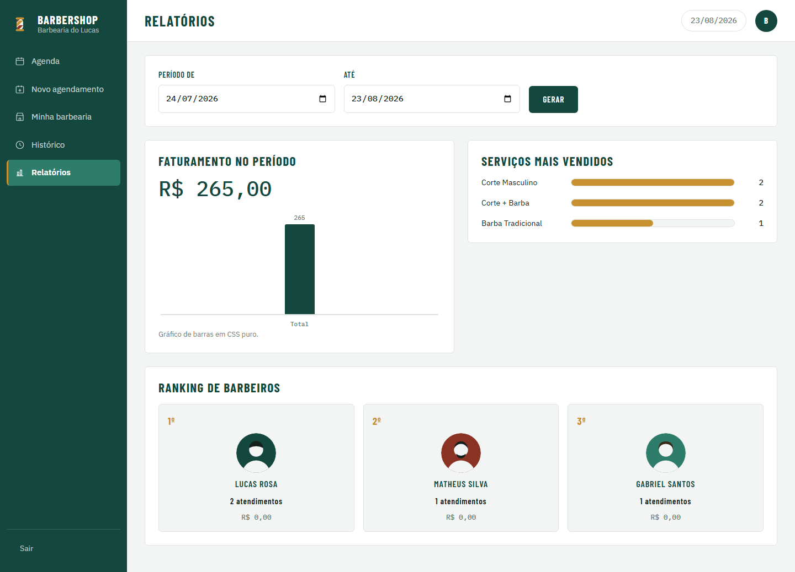 |

---

## 👨‍💻 Author

**Lucas Hochmann Rosa**

- Repository: <https://github.com/lucas-hochmann-rosa/barber-shop-suite>
- GitHub: <https://github.com/lucas-hochmann-rosa>
- LinkedIn: <https://www.linkedin.com/in/lucas-hochmann-rosa>

---

## 📄 License

Distributed under the MIT License. See [LICENSE](./LICENSE) for details.
